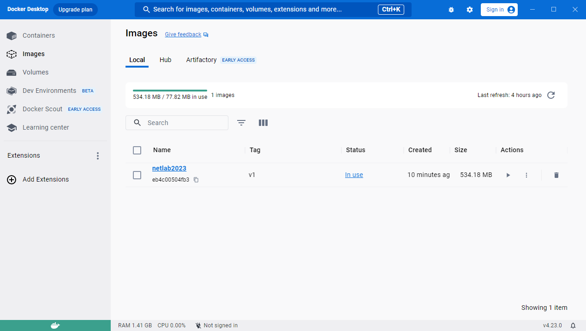
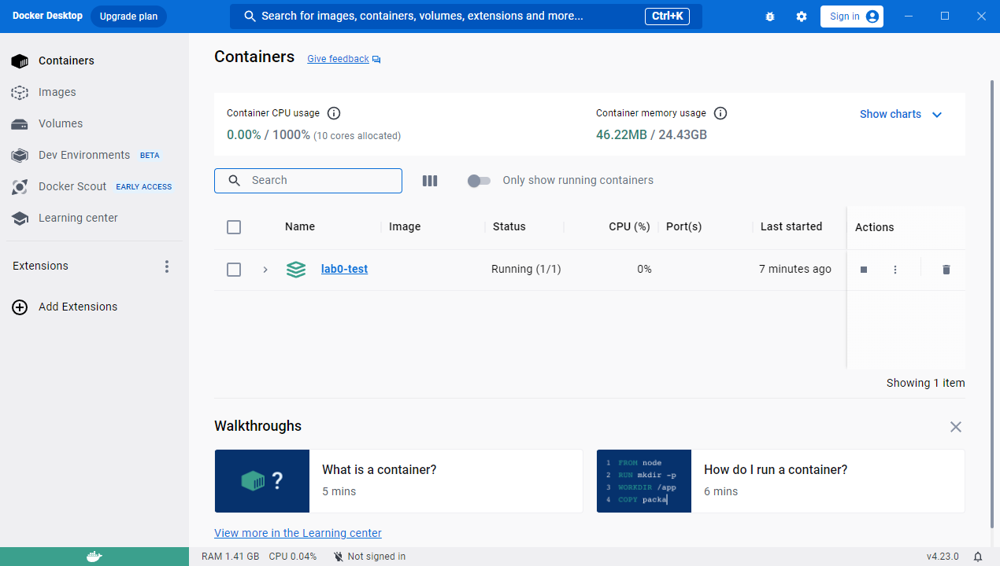
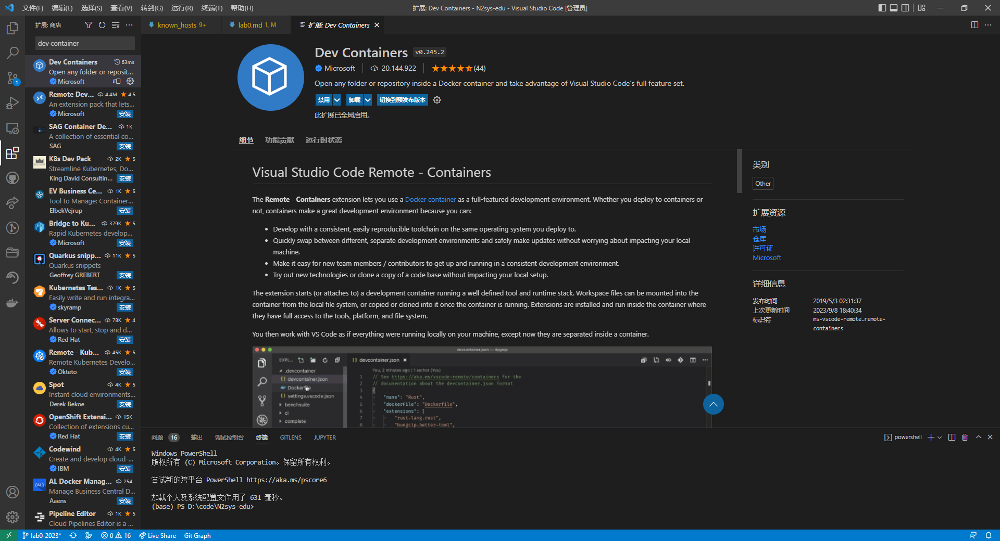
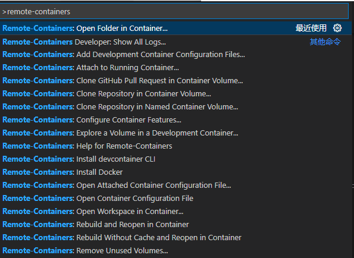
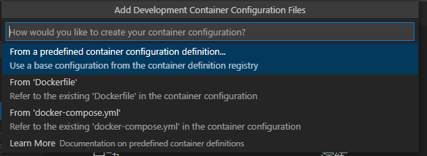
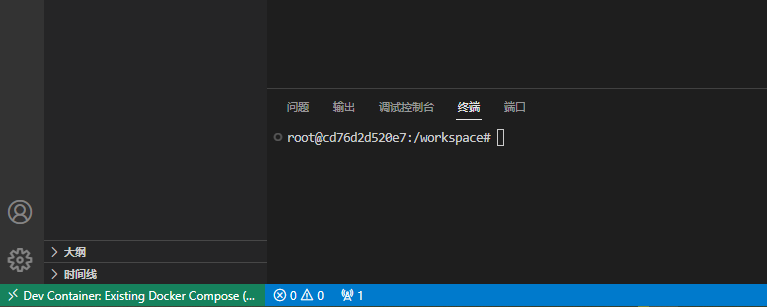

# Lab0

> 请从[北大教学网](https://course.pku.edu.cn)获取接受本Lab任务的链接  

本 Lab 的主要目的是为了让同学们能够更加快速的上手 Github Classroom 和 Docker

在本 Lab 中你要做的事情非常简单,我们将在下面的内容中介绍

本 Lab 不计入本课程的分数,但是我们仍希望你能够完成,一方面可以确认 Github Classroom 名单中人员和你的 Github 账号的绑定情况,另一方面你可以开始上手使用 Github 以及 Github Classroom 实现自动评测

## 实验环境

### Docker 安装

> 提示：  
> Docker 对于本课程的实验 Lab 并不是必须的，如果你对 Linux 系统编程非常熟悉，你也可以选择自己喜欢的开发环境进行开发，但我们不负责对其中遇到的问题进行解答。  
> 可以参考下述 Dockerfile 中安装的依赖来配置 Lab 需要的编译工具链。

如果你选择使用 docker，我们提供以下步骤来帮助你完成环境的搭建。

你首先需要在自己的电脑上安装 docker 环境，关于这部分内容我们不会作详细的描述，请参考 [Get Docker](https://docs.docker.com/get-docker/) 官方教程。

你可以通过在命令行中输入 `docker --version` 检测是否安装成功，如果出现类似下述的提示则说明成功。

```bash
$> docker --version
Docker version 24.0.6, build ed223bc
```

### Docker 镜像构建

接下来，我们将从一个纯净的 ubuntu 22.04 镜像开始构建我们 Lab 所需要的实验环境。  
我们在下发文件中提供了如下 `Dockerfile` 用于构建镜像：

```dockerfile
FROM ubuntu:22.04
LABEL maintainer="songyuchen@stu.pku.edu.cn"
COPY sources.list.x86 /etc/apt/sources.list
RUN apt update && apt install cmake gcc g++ ninja-build vim openssh-server ca-certificates curl git --yes --force-yes && echo 'root:123456' | chpasswd
COPY sshd_config.txt /etc/ssh/sshd_config
```

在终端中执行命令：

```bash
docker buildx build -t netlab2023:v1 -f Dockerfile . --platform linux/amd64
```

> 解释：  
> 在 Dockerfile 文件中，我们拉取了一个 ubuntu 22.04 的官方精简镜像，将 apt 安装源替换为 tuna 源，并设置 ssh 允许 root 登录，然后安装了相应的编译工具包。  
> 通过执行命令，我们使用 Dockerfile 构建了一个名为 netlab2023 的本地 linux/amd64 架构的镜像。

你可能会遇到网络问题，无法成功地从 Docker 官网拉取到 ubuntu 镜像。  
可以尝试将 Dockerfile 的第一行替换为如下内容（这里使用的是上交提供的镜像地址，你也可以自行尝试其它地址）。

```dockerfile
FROM docker.mirrors.sjtug.sjtu.edu.cn/library/ubuntu:22.04
```

此时你应该已经构建好了镜像。在终端中输入 `docker images` 或在 Docker Hub 图形界面中应该可以看到你刚才构建好的镜像。  
命令行应该输出如下的类似结果：

```bash
$> docker images
REPOSITORY   TAG       IMAGE ID       CREATED         SIZE
netlab2023   v1        eb4c00504fb3   9 minutes ago   534MB
```

Docker Hub 中应该能看到如图的类似结果：



### Docker 容器启动

接下来我们使用上一步构建好的 netlab2023 镜像启动一个容器。  
我们在下发文件中提供了以下 `docker-compose.yml` 文件用于启动容器：

```yaml
services:
  netlab-lab1:
    image: netlab2023:v1
    container_name: netlab-lab0
    volumes:
      - ./workspace:/workspace
    ports:
      - 20729:22
    tty: true
```

> 解释：  
> 上述 `docker-compose.yml` 文件使用名为 netlab2023 的镜像启动了一个名为 netlab-lab0 的容器，并将目录下的 workspace 文件夹映射到容器内的 `/workspace` 目录（如果本地不存在该文件夹则会自动创建），且将本机的 20729 端口与容器的 22 端口相连，便于后续我们通过 ssh 连接进容器内部进行开发。

在终端中运行如下命令启动容器：

```bash
docker-compose up -d
```

此时容器应该已经启动完成。在终端中输入 `docker ps -a` 或在 Docker Hub 图形界面中应该可以看到你刚才启动好的容器。  
命令行应该输出如下的类似结果：

```bash
$> docker ps -a
CONTAINER ID   IMAGE          COMMAND       CREATED         STATUS         PORTS                   NAMES
62d98f673458   eb4c00504fb3   "/bin/bash"   5 minutes ago   Up 5 minutes   0.0.0.0:20729->22/tcp   netlab-lab1
```

Docker Hub 中应该能看到如图的类似结果：



### 配置开发环境

#### 方案一：使用 ssh

此时你已经获得了一个可以编写、运行 Lab 代码的实验环境，你可以使用你喜欢的编辑器来进行代码开发，不过这里我们选择使用 vscode 作为例子。我们将使用在上述过程中配置好的 ssh 登陆方式，使用 vscode 远程窗口来进行演示。

在配置镜像阶段，我们已经通过配置 sshd_config 文件打开了 ssh 登录配置；在启动容器阶段，我们也将主机的 20729 端口与容器的 22 端口相连。此时我们需要在命令行中执行如下命令重启容器的 ssh 服务：

```bash
docker exec netlab-lab0 /bin/bash -c "service ssh restart"
```

应该有如下类似的结果：

```bash
$> docker exec netlab-lab0 /bin/bash -c "service ssh restart"
 * Restarting OpenBSD Secure Shell server sshd
   ...done.
```

此时我们使用 ssh 尝试连接主机：

```bash
ssh root@127.0.0.1 -p 20729
```

应该有如下类似的结果：

```plain
$> ssh root@127.0.0.1 -p 20729
The authenticity of host '[127.0.0.1]:20729 ([127.0.0.1]:20729)' can't be established.
ECDSA key fingerprint is SHA256:EwSp0Q1twJiPhtvNn0+DiTI1ym3gVY+2cdImM8q6gdI.
Are you sure you want to continue connecting (yes/no/[fingerprint])?
```

输入 yes 以继续，然后输入我们设置的密码 123456 即可登入进入容器。完整的运行结果应该类似如下：

```plain
$> ssh root@127.0.0.1 -p 20729
The authenticity of host '[127.0.0.1]:20729 ([127.0.0.1]:20729)' can't be established.
ECDSA key fingerprint is SHA256:EwSp0Q1twJiPhtvNn0+DiTI1ym3gVY+2cdImM8q6gdI.
Are you sure you want to continue connecting (yes/no/[fingerprint])? yes
Warning: Permanently added '[127.0.0.1]:20729' (ECDSA) to the list of known hosts.
root@127.0.0.1's password: 
Welcome to Ubuntu 22.04.3 LTS (GNU/Linux 5.10.16.3-microsoft-standard-WSL2 x86_64)

 * Documentation:  https://help.ubuntu.com
 * Management:     https://landscape.canonical.com
 * Support:        https://ubuntu.com/advantage

This system has been minimized by removing packages and content that are
not required on a system that users do not log into.

To restore this content, you can run the 'unminimize' command.

The programs included with the Ubuntu system are free software;
the exact distribution terms for each program are described in the
individual files in /usr/share/doc/*/copyright.

Ubuntu comes with ABSOLUTELY NO WARRANTY, to the extent permitted by
applicable law.

root@cdcb92e78b58:~#
```

这就说明我们的 ssh 配置是成功的。在 vscode 中进行远程连接的配置即可，可以参考 [zhihu](https://zhuanlan.zhihu.com/p/141205262)。  
对应的 ssh config 配置文件可以参考如下文本

```plain
Host netlab
    HostName 127.0.0.1
    User root
```

自此我们的实验环境配置就结束了。

> 警告：  
> 上述说明文档中从便于操作的角度进行了一些不太安全的配置，请勿用于生产环境。  
> 从安全的角度出发，我们建议你修改 `Dockerfile` 中最后一行 `echo 'root:123456' | chpasswd` 中关于设置 root 密码的部分，以及在 `docker-compose.yml` 文件中关于端口映射的部分。

#### 方案二：使用 dev container 插件

一些同学反应，在成功运行 docker 容器后，使用 vscode 连接进入容器出现了一些问题，这里给出另一个可选的方案。  
在 vscode 插件目录中查找插件 `Dev Containers` 如下并点击安装：



新建一个 vscode 窗口，然后按下 `Ctrl + P` ，在上方弹出的窗口中输入 `> remote-containers`，找到其中的 `Open Folder in Container` 并点击



此时会弹出一个选择文件夹的窗口，选择你下载的 `lab0-addon` 压缩包解压后的文件夹。插件会自动识别到文件夹目录下的 `Dockerfile` 和 `docker-compose.yml` 两个文件，并弹出如下所示的选项：



如果在上面的流程中，你已经成功运行了 `Dockerfile` 的内容，请选择 `From 'docker-compose.yml'`；否则请选择 `From 'Dockerfile'`。

在等待一段时间后，vscode 应该已经自动启动了容器并进入容器环境。你可以查看 vscode 页面左下角是否出现 `Dev Container: ...` 类似标记。



## 编译与执行

### 编译环境

如果你按照上述流程 docker 配置好了 docker 容器环境，那么你的编译环境应该就已经配置好了。  
在 workspace 目录下，通过 `git clone` 命令将你的 repo 拉取下来。

### 编译准备

通过完成如下的步骤我们可以完成编译之前的准备工作(只需要完成一次即可,此后的每一次编译无需完成)

在命令行/终端/Terminal中执行如下的指令

1. `mkdir -p build`
2. `cd build`
3. `cmake .. -G "Ninja"`

如此我们完成了编译的准备工作

### 编译

在 build 目录中,我们只需要执行 `ninja` 指令即可编译。

### 执行

如果你完成了这个 lab 要做的内容（参见下一节），这里执行之后我们注意到build目录下生成了 hellonetwork 的可执行程序,不妨执行一下`./hellonetwork`执行即可

可执行程序`hellonetwork`接收一个参数,该参数为`0`或`1`,不同的参数会输出不同的结果

## 你要做什么

在本Lab中,你只需要使得你的程序在执行`./hellonetwork 1`的时候能够输出`Hello Network Hello PKU`即可

为此，你需要进行两个修改

1. 修改`CMakeLists.txt`使其能够生成可执行文件`hellonetwork`
2. 修改代码`hellonetwork.cpp`使得其能够在执行上述的命令时输出正确的值

提交代码的方式非常简单

如果你已经对Git的使用方法非常熟练了那么实际上你只需要将项目push到Github上即可

即在项目的根目录中执行

``` bash
git add .
git commit -am “Update”
git push
```

## 评测

在你将项目Push到Github之后,在仓库的Action选项卡中能看见自动评测的进度和结果
